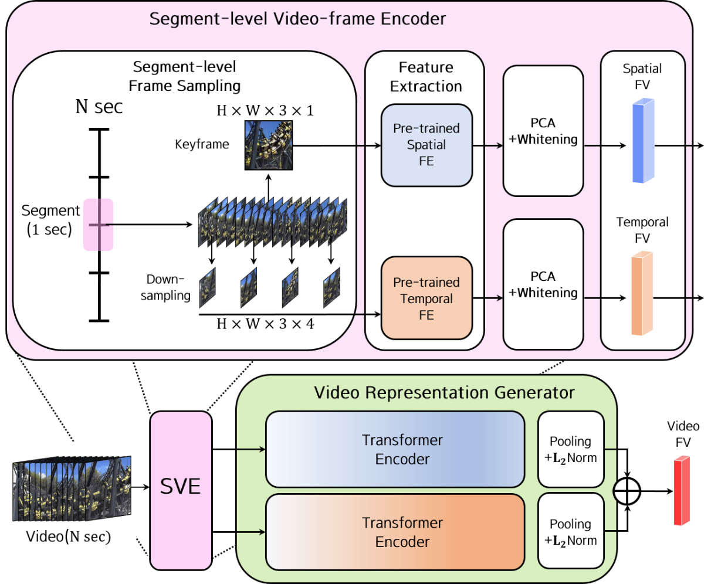

# segment_temporal_context_aggregation
Segment Temporal Context Aggregation for Video Retrieval on an Incident Basis with Aggregation of Keyframe and Temporal Features

## Introcution

This transformer encoder-based two-stream fusion structure that separately processes the time-dependent features of video segments extracted based on pre-trained action classifica-tion network and the spatial features of keyframes extracted with pre-trained weights by self-supervised learning methods. VCDB benchmarks are used for learning. The method shows performance (~2% mAP) beyond the State-of-the-art fine-grained incident video retrieval method using video level representation in all tasks in FIVR-200K.

## License
This project is licensed under the Apache License 2.0 - see the LICENSE file for details.

## Contact
donghoon.rhie@gmail.com
