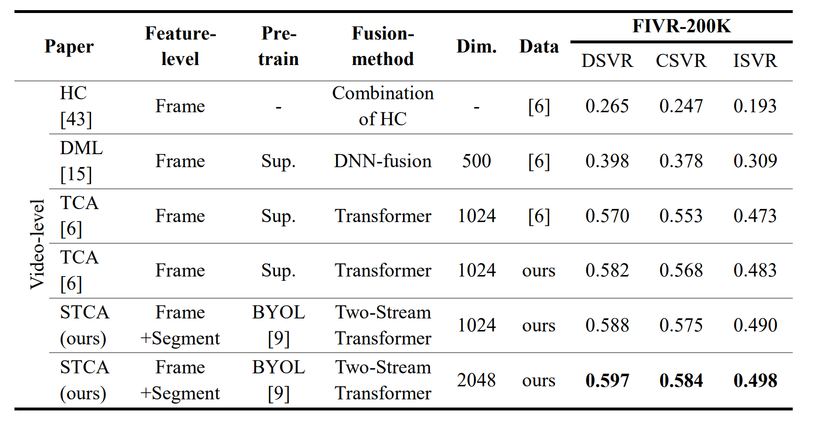

# segment_temporal_context_aggregation
Segment Temporal Context Aggregation for Video Retrieval on an Incident Basis with Aggregation of Keyframe and Temporal Features

## Introcution


This transformer encoder-based two-stream fusion structure that separately processes the time-dependent features of video segments extracted based on pre-trained action classifica-tion network and the spatial features of keyframes extracted with pre-trained weights by self-supervised learning methods. VCDB benchmarks are used for learning. The method shows performance (~2% mAP) beyond the State-of-the-art fine-grained incident video retrieval method using video level representation in all tasks in FIVR-200K.




## License
This project is licensed under the Apache License 2.0 - see the LICENSE file for details.

## Contact
donghoon.rhie@gmail.com

## Citation
If you use this code for your research, please our paper.
```
@masterthesis{__2022,
   title = {사건 단위 비디오 검색을 위한 키프레임 특징과 시간-의존적 특징 벡터를 융합한 비디오 특징 벡터 생성 방법},
   url = {http://www.riss.kr/link?id=T16013478},
   school = {서강대학교 대학원},
   author = {{이동훈}},
   year = {2022},
   note = {국내석사학위논문},
}
